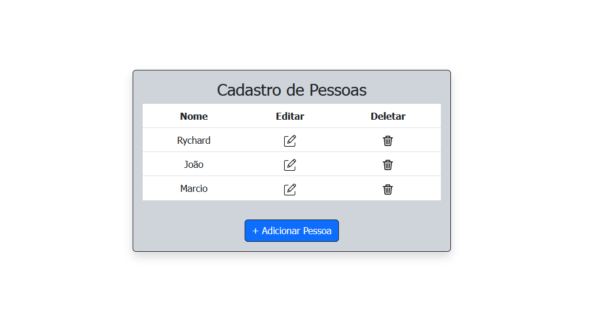
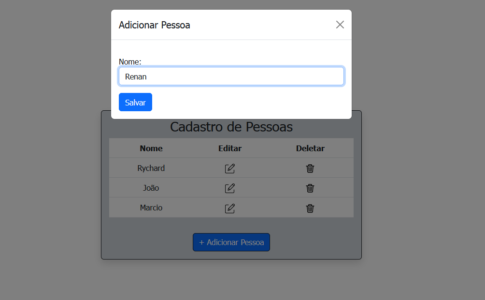
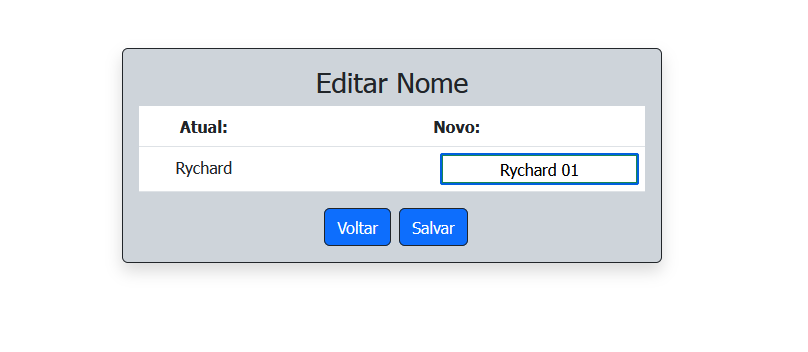

# CRUD-Django
⚙️ Repository dedicated to the creation of a CRUD system that contains the necessary functions to make it functional, containing interaction with a relational database.


# Description

This is a Django project that implements CRUD (Create, Read, Update and Delete) operations for an entity called "Person". CRUD is a common approach to data management operations in information systems and web applications. In this project, CRUD is used to allow users to create, read, update and delete person records in the system.

The project makes use of the Bootstrap front-end framework, which offers a set of ready-to-use components and styles, making the user interface modern and responsive. In addition, the database used is SQLite, a lightweight and easy to configure database, which is suitable for smaller applications and rapid development projects.

Through the available pages and forms, users can intuitively interact with the system and manage people's data efficiently.
What is CRUD?

CRUD is an abbreviation for the following operations:

     Create (C): Creation or insertion of new records in the database.
     Read (R): Reading or retrieving database records.
     Update (U): Updating or modifying existing records in the database.
     Delete (D): Deletion of existing records in the database.

These operations form the basis for managing data in many systems, including web applications, mobile applications, and database management systems.
CRUD operation

In the context of a web application, CRUD is implemented as follows:

     Create (C): The user has the option to create new records by providing information in a form. After filling in the necessary fields, the user submits the form, and the data is sent to the server. The server processes the received data and inserts a new record in the database.

     Read (R): User can view existing records in a list or table. These records are retrieved from the database and displayed in the user interface.

     Update (U): User can edit or update an existing record. To do this, the user selects the record they want to edit and opens a form filled with current information for that record. The user can modify the required information and submit the form. The server processes the received data and updates the corresponding record in the database.

     Delete (D): User can delete an existing record. To do this, the user selects the record he wants to delete and confirms the deletion. The server receives the delete request and removes the corresponding record from the database.

## Installation

1. Clone the repository:
```bash
git clone https://github.com/rychardbarros/CRUD-Django.git
cd CRUD-Django
```
2. Create and activate a virtual environment (optional but recommended):
```bash
pip install virtualenv
python -m venv venv

# On Windows
venv\Scripts\activate

# On Linux/Mac
source venv/bin/activate
```
3. Install the dependencies:
```bash
install -r requirements.txt
```
## To run the CRUD-Django, follow the steps below:
Open a terminal or command prompt.
Navigate to the directory:
```bash
cd path/to/the/CRUD-Django
```
Start the crud:
```bash
python manage.py runserver
```

# Layout







# License 📚
[MIT license](LICENSE).

Made by [Rychard Barros](https://github.com/rychardbarros)

